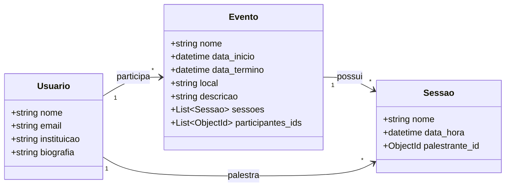

## Trabalho_Final_Persistencia
> Persistência de dados de um **Sistema de Gerenciamento de Eventos Acadêmicos** utilizando MongoDB e FastAPI.

## 🚀 Diagrama de Classes 


## 🚀 Instalando Gerenciador de Eventos Acadêmicos

Para baixar o reposiótio o Gerenciador de Eventos Acadêmicos, siga estas etapas:

```
git clone <link do repositório>
```

## ☕ Usando o Gerenciador de Eventos Acadêmicos

Para usar o Gerenciador de Eventos Acadêmicos, siga estas etapas:

```
pip install uvicorn

fastapi dev main.py
```
